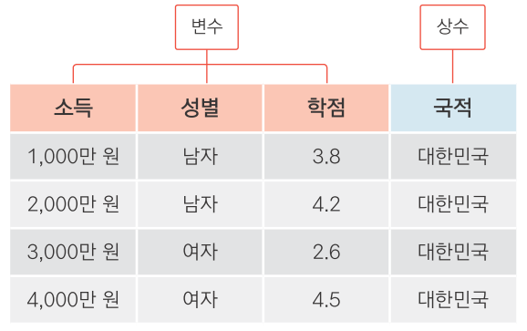
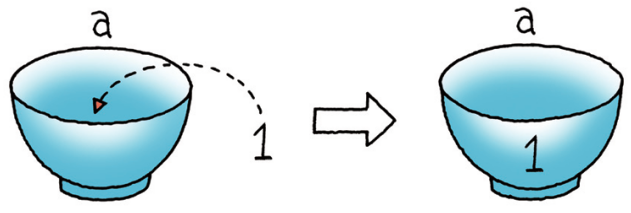
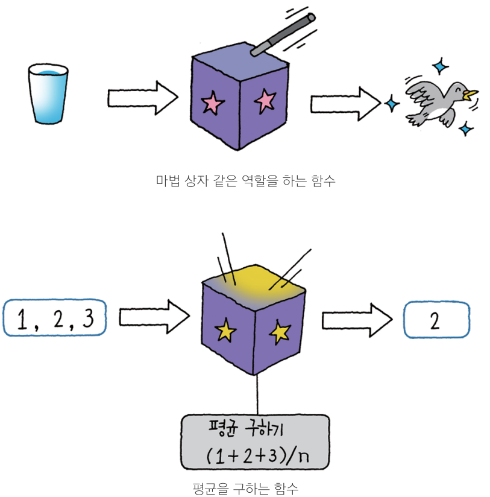

<style>
div.gray pre {background-color:lightgray;}
div.gray pre.r {background-color:gray;}
</style>

<style type="text/css">

body{ /* Normal  */
      font-size: 16px;
  }
td {  /* Table  */
  font-size: 16px;
}
h1.title {
  font-size: 38px;
  color: Black;
}
h1 { /* Header 1 */
  font-size: 28px;
  font-weight: bold;
  color: DarkBlue;
}
h2 { /* Header 2 */
  font-size: 22px;
  font-weight: bold;
  font-family: NanumGothic;
  color: DarkBlue;
  
}
h3 { /* Header 3 */
  font-size: 18px;
  font-weight: bold;
  font-family: NanumGothic;
  color: DarkBlue;
}
h4 { /* Header 4 */
  font-size: 16px;
  font-weight: bold;
  font-family: NanumGothic;
  color: Black;
}
code.r{ /* Code block */
    font-size: 12px;
}
    font-size: 14px;
}
</style>

```{r xaringanExtra-clipboard, echo=FALSE}
xaringanExtra::use_clipboard()
```

# 01. R Data 분석 환경 구축 및 기초

## **0. R & RStudio**
- R은 통계 프로그래밍 플랫폼입니다. 처음에는 통계학자들이 주로 사용하였으나, 최근에는 사회과학 전분야에서 두루 활용되고 있습니다. R이 인기를 끄는 데는 두 가지 이유가 있습니다. 잘 알려진 SPSS나 SAS와 달리 GNU license로서 오픈소스에 무료입니다. 게다가 다양한 패키지를 연결하여 기능을 크게 확장할 수 있습니다.   
  
- RStudio는 R을 쉽게 사용할 수 있게 해주는 통합 개발 환경(integrated  development environment,> 
IDE)입니다. Visual Studio나, Google Colab을 사용하시는 분도 있지만, 일반적으로 RStudio를 통해 R을 사용합니다. 


  
  
## 1. R 과 RStudio 설치

R을 이용하는 방법에는 로컬컴퓨터(자신의 컴퓨터)와 클라우드를 이용하는 방법 2가지가 있습니다. 

#### 1) 컴퓨터에 R을 설치해 이용
  - 장점: 내 컴퓨터에서 사용하므로 편의성이 높다.  
  - 단점: 컴퓨터 사양이 낮으면 매우 불편하다.  
      
#### 2) 클라우드에서 R 이용
  - 장점: 컴퓨터 사양이 낮아도 브라우저만 있으면 된다.   
  - 단점: 매번 패키지를 설치해야 한다.   
  
    ※ [RStudio클라우드](http://studiocloud.com/)와 [구글 코랩](http://colab.to/r) 등이 R을 클라우드에서 사용할 수 있는 IDE입니다.   
       구글 코랩의 기본값은 파이썬이지만, 위 주소로 연결하면 R이 사용언어로 설정됩니다.  

---  

### 1-1. R과 Rtools 로컬컴퓨터에 설치하기

#### 1) 설치 경로에 한글이 섞여있으면 향후 진행이 어렵습니다.  
  가능하면 C://이후 user명도 한글이 아닌 영어로 변경해야합니다.  
  또한 모든 설치 파일은 '관리자 모드로 실행' 해주셔야 합니다.  
  (참고 링크: [https://url.kr/b4zkl2](https://url.kr/b4zkl2))

#### 2) R project사이트에서 접속 링크 [(cloud.r-project.org)](https://cloud.r-project.org/)로 직접 접속하거나, 구글에서 “r project” 검색
  
#### 3) 본인의 운영체제에 맞는 R다운로드 후 설치  
R을 설치하고 실행하면 콘솔 창이 열립니다. > 프롬프트가 뜨면 정상입니다. 

#### 4) Rtools는 [이곳](https://cran.r-project.org/bin/windows/Rtools/rtools40.html)을 클릭하신 뒤, [rtools40v2-x86_64.exe] 를 다운받아주세요. 

#### 5) 이후 **rtools40v2-x86_64.exe** 파일을 실행시키시고, 계속 '다음'을 누르셔서 설치하시면 됩니다.

#### 6) 설치가 완료 된 이후에는 환경변수 설정을 해주셔야 합니다.  
이 부분은 학습 시간에 함께 진행하겠습니다.   
  
    - RTOOLS40_HOME 환경변수 생성: 값 - `C:\rtools40`
    - 윈도우 검색창에 '시스템 환경 변수 편집' 검색  
    - system variable > edit 하여 환경변수 추가
    - system variables > path에 %RTOOLS40_HOME%\usr\bin 추가
  
  
---  

### **1-2. Rstudio 로컬컴퓨터에 설치하기**  
  

1) 구글에서 ’rstudio’를 검색하거나 이 링크 [R Studio Desktop Free](https://rstudio.com/products/rstudio/download/#download)에서 다운로드 받아 설치합니다. 
  
2) 설치한 다음 아래처럼 실행되면 설치에 성공한 것입니다.  화면에 3개의 창틀이 열려 있는데, 각 창을 pane(창틀)이라고 합니다. 
  
3) 대부분의 IDE들은 비슷한 인터페이스를 가지고 있습니다. RStudio는 Matlab과 비슷한 인터페이스를 가지고 있으며, 처음 쓰시는 분들도 직관적으로 이해하실 수 있습니다.


  * Editor: 편집기. 워드프로세서에 글을 쓰듯이, 스크립트를 편집하고 저장하고 열어보는 데 사용합니다. ‘도킹해제 undock’를 통해 큰 화면에서 별도로 작업할 수 있습니다. 
  * Console: 명령어를 입력하고 출력을 확인합니다. 매우 유용하게 쓰입니다. 
  * Environment & History: 현재 사용 중인 변수들와 지금까지 사용한 명령어를 각각 보여줍니다.
  * Files: MS윈도우의 탐색기 또는 OSX의 Finder 역할을 합니다. 현재 위치를 보여줍니다. 
          Console 창에 `getwd()`을 입력해서 현재 위치를 볼 수도 있습니다. 
  * Plots: 그래프를 볼 때 사용합니다.
  * Packages: 지금까지 설치한 패키지와 현재 사용중인 패키지를 보여줍니다. 새로운 패키지를 설치할 때도 사용합니다. 
      + *Update*를 실행해봅시다. 자주 업데이트 하는 것이 좋습니다.
      + *Install*을 실행하여 **vcd**라는 패키지를 설치해봅시다. 이 패키지의 내용이 무엇인지도 인터넷으로 알아봅시다.
  * Help: 도움말
  * Viewer: 웹컨텐츠를 볼 때 사용합니다.  
   

4) 여기까지 모든 설치가 잘 끝났는지 확인하기 위해 Rstudio console 창에 아래와 같이 입력 후 확인합니다.   
  
```{r eval=FALSE}
Sys.which('make')

#                             make 
#"C:\\rtools40\\usr\\bin\\make.exe"
```

---  

### **1-3. 작업환경 있어보이게 만들기**  
  
  - 가독성을 높여주는 Ligature 폰트를 적용합니다. 
  - Github에 올라와 있는 Firacode 를 [링크](https://github.com/tonsky/FiraCode/releases/download/6.2/Fira_Code_v6.2.zip)에서
    다운해줍니다.   
  - 압축해제 후, ttf 폴더에 들어가셔서 **모든 사용자용으로 설치** 를 해줍니다. 
  - 이후, 아래 두줄을 실행시킨 뒤 Rstudio를 종료하세요.   

```{r eval=FALSE}

install.packages("remotes")
remotes::install_github("anthonynorth/rscodeio")

```
  - 관리자 권한으로 Rstudio을 열어서 아래 명령을 실행시켜주세요. 
  
```{r eval=FALSE}

rscodeio::install_theme()

```

  - Rstudio의 Tools > Global options > appearance 에 가셔서 폰트를 Fira 폰트로 바꿔줍니다. 


---  

## 2. R 언어 입문하기
  
  
### 2-1. Hello world
  
 - 프로그래밍을 배울 때, 가장 처음 해보는 **Hello World**로 R 언어 기초 과정을 시작하겠습니다. 

```{r eval=FALSE}
# 1.1 R 소개
# 문자형 벡터 생성
sen <- 'Hello World!'

# 벡터 sen을 콘솔창에 출력
print(x = sen)

# 벡터 sen의 클래스 확인
class(x = sen)

# 벡터 sen의 원소 개수 확인
length(x = sen)


# 1.2 R 객체의 특징
# a에 1, b에 2를 할당
a <- 1
b <- 2

# a에 b를 할당하면 b의 값이 a로 전달
a <- b
# b에 3을 할당해도 a의 값은 2로 유지
b <- 3

# a와 b를 콘솔창에 출력
print(x = a); print(x = b)

# 객체명이 숫자로 시작하면 에러가 발생합니다.
 1a <- 3

# 객체명을 숫자로 시작하려면 백틱으로 감싸주어야 하며,
# 객체를 출력할 때에도 백틱을 사용해야 함
`1a` <- 3
print(x = `1a`)

# 백틱 대신 따옴표로 객체를 생성할 수 있지만,
# 출력할 때에는 문자열로 인식되므로 백틱을 사용해야 함
'2a' <- 4
print(x = '2a')

```


### **2-2. 자료구조(1) 벡터 **

 - 자료구조의 첫번째 과정으로 '벡터'에 대해 학습하고자 합니다.  
 - 먼저, 자료형(data type)에 대해 간단하게 알아보겠습니다.   
    - 실수형(numeric): 허수를 포함하는 복소수가 아닌 숫자  
    - 정수형(integer): 소수점이 없는 숫자  
    - 문자형(character): 따옴표로 감싼 문자열(string)  
    - 논리형(logical): 따옴표가 없는 TRUE 또는 FALSE만 있는 자료형입니다.  
    - 범주형(factor): 4가지 자료형을 명목형으로 변환하면 범주형(요인)이 됩니다. 

```{r, eval=FALSE}

# 2.2.1 실수형과 정수형 벡터 생성 : c(), c는 combine의 약자입니다. 
# 숫자 1, 2, 3은 실수형 벡터를 생성합니다.
a <- c(1, 2, 3)

# 벡터 a를 출력
print(x = a)

# 벡터 a의 클래스 확인
class(x = a)

# 숫자 뒤에 대문자 L을 붙여야 정수형 벡터를 생성
b <- c(1L, 2L, 3L)

# 벡터 b를 출력
print(x = b)

# 벡터 b의 클래스 확인
class(x = b)

# 벡터를 출력하면 콘솔창 왼쪽에 [1] 형태가 출력되는데
# 괄호안 숫자는 벡터 원소의 인덱스를 가리키는 것임
print(x = 101:150)


# 2.2.2 문자형과 논리형 벡터 생성 : c()
# 따옴표로 감싼 문자열은 문자형 벡터를 생성
c <- c('hello', 'world')

# 벡터 c를 출력
print(x = c)

# 벡터 c의 클래스 확인
class(x = c)

# 따옴표 없는 FALSE와 TRUE는 논리형 벡터를 생성
d <- c(FALSE, TRUE)

# 벡터 d를 출력
print(x = d)

# 벡터 d의 클래스 확인
class(x = d)

# [팁] T와 F를 객체명으로 사용하지 않는 것을 권장!
# T를 출력하면 TRUE가 출력됨
print(x = T)

# T에 F를 할당하고 다시 출력하면 FALSE가 출력됨
T <- F
print(x = T)


# 2.2.3 원소가 없는 빈 벡터 생성
c()

# 2.2.4 범주형 벡터 생성 : factor(), as.factor()
# 문자형 벡터 nat를 생성
nat <- c('한국', '일본', '중국', '미국', '중국', '한국', '미국', '일본')

# 벡터 nat를 출력
print(x = nat)

# 문자형 벡터를 범주형 벡터로 변환
fct <- as.factor(x = nat)

# 벡터 fct를 출력하면 레벨이 추가됨
print(x = fct)

# 범주형 벡터는 정수형 또는 문자형 벡터로 변환 가능
# 범주형 벡터의 원소는 레벨의 인덱스를 가지고 있기 때문
as.integer(x = fct)

# 범주형 벡터를 생성할 때 레벨 순서를 정할 수 있음
fct <- factor(x = nat, levels = c('한국', '미국', '중국', '일본'))

# 벡터 fct를 출력하면 레벨 순서가 달라진 것을 확인
print(x = fct)

# 레벨 순서가 달라졌으므로 레벨의 인덱스도 변경되었음
as.integer(x = fct)


# 2.2.5 원소가 연속되는 벡터 생성 : seq()
# 1부터 3까지 간격이 1인 실수형 벡터 생성
seq(from = 1, to = 3, by = 1)

# 간격이 1 또는 -1이면 콜론 사용 가능
1:3

# 3부터 1까지 간격이 -1인 실수형 벡터 생성
seq(from = 3, to = 1, by = -1)

# 1부터 10까지 간격이 2.5인 실수형 벡터 생성
seq(from = 1, to = 10, by = 2.5)

# 1부터 10까지 원소 개수가 19개인 실수형 벡터 생성
seq(from = 1, to = 10, length = 19)

# 매개변수 생략
seq(1, 3, 1)

# 인수 하나만 설정
seq(3)

# by와 length.out을 동시에 설정하면 에러 발생
seq(1, 3, 1, length.out = 5)

# by를 생략하면 length.out 설정 가능
seq(1, 3, length.out = 5)

# length.out 대신 length 사용 가능
seq(1, 3, length = 5)


# 2.2.6 원소가 반복되는 벡터 생성 : rep()
# 원소가 1개인 벡터를 세 번 반복
rep(x = 1, times = 3)

# 원소가 3개인 벡터를 세 번 반복
rep(x = 1:3, times = 3)

# 벡터의 각 원소를 세 번씩 반복
rep(x = 1:3, each = 3)

# 원소 개수가 10이 될 때까지 반복
rep(x = 1:3, length = 10)


# 2.3.1 인덱싱
print(x = letters)

# 문자형 벡터 letters의 첫 번째 원소만 선택
letters[1]


# 2.3.2 슬라이싱
# 문자형 벡터 letters의 1~5번째 원소를 s에 할당
s <- letters[1:5]
print(x = s)


# [팬시 인덱싱] 벡터 s의 1, 3, 5번째 원소를 선택
s[c(1, 3, 5)]

# [불리언 인덱싱] TRUE 위치에 해당하는 벡터 s의 원소 선택
s[c(TRUE, FALSE, TRUE, FALSE, TRUE)]


# 2.4 벡터 원소 추가
# 벡터 s의 여섯 번째 원소 추가
s[6] <- 'f'
print(x = s)

# 벡터 s의 열 번째 원소 추가. 7~9번째 원소는 NA로 생성
s[10] <- 'j'
print(x = s)


# 2.5 벡터 원소 삭제
# 벡터 s의 열 번째 원소를 삭제한 결과를 반환
s[-10]

# 벡터 s를 출력하면 열 번째 원소가 그대로 있음
print(x = s)

# 벡터 s의 열 번째 원소를 삭제한 결과를 s에 재할당
s <- s[-10]

# 벡터 s를 출력하면 열 번째 원소가 삭제되었음
print(x = s)


# 2.6.1 인덱싱과 슬라이싱을 이용해 변경하기
# 벡터 s의 첫 번째 원소를 'A'로 변경
s[1] <- 'A'
print(x = s)

# 벡터 s의 두 번째 원소를 'B'로 변경
s[2] <- 'B'
print(x = s)

# 벡터 s의 1~2 번째 원소를 '가', '나'로 변경
s[1:2] <- c('가', '나')
print(x = s)


# 2.6.2 범주형 벡터 원소 변경하기
# 문자형 벡터는 원소 변경이 쉬움
nat[8] <- '대만'
print(x = nat)

# 범주형 벡터는 레벨에 없는 원소로 변경하려고 하면
# 결측값으로 변환됨
fct[8] <- '대만'
print(x = fct)

# 범주형 벡터의 레벨을 문자형 벡터로 출력하고
# 마지막 레벨로 '대만'을 추가
levels(x = fct)
levels(x = fct)[5] <- '대만'

# 레벨에 있는 원소로는 변경 가능
fct[8] <- '대만'
print(x = fct)


# 2.7.1 정수로 형변환 : as.integer()
as.integer(x = 1.2)
as.integer(x = '1.2')
as.integer(x = FALSE)

# 2.7.2 실수로 형변환 : as.numeric()
as.numeric(x = 1L)
as.numeric(x = '1.2')
as.numeric(x = TRUE)

# 2.7.3 문자열로 형변환 : as.character() 
as.character(x = 1L)
as.character(x = 1.2)
as.character(x = TRUE)

# 2.7.4 논리형으로 형변환 : as.logical()
as.logical(x = 0)
as.logical(x = 1.2)
as.logical(x = '1.2')

# 2.7.5 범주형으로 형변환 : as.factor()
e <- as.factor(x = c)
print(x = e)
class(x = e)
as.integer(x = e)

# 2.8 벡터 강제변환
c <- c('hello', 'world')
d <- c(FALSE, TRUE)
e <- as.factor(x = c)

# 논리형 벡터와 범주형 벡터가 결합하면 
# 정수형 벡터로 강제변환됨
f <- c(d, e)
print(x = f)
class(x = f)

# 정수형 벡터에 실수형 스칼라가 결합하면
# 실수형 벡터로 강제변환됨
f <- c(f, 3)
print(x = f)
class(x = f)

# 실수형 벡터에 문자형 스칼라가 결합하면
# 문자형 벡터로 강제변환됨
f <- c(f, '4')
print(x = f)
class(x = f)


# 2.9.1 덧셈, 뺄셈 연산
# 원소 개수가 같은 벡터 생성
a <- c(0, 2, 4)
b <- c(1, 2, 3)

# 원소 개수가 같은 벡터끼리 덧셈, 뺄셈 연산
a + b
a - b

# a와 원소 개수가 다른 벡터 생성
c <- seq(from = 1, to = 11, by = 2)
d <- seq(from = 3, to = 12, by = 3)

# 원소 개수가 서로 다른 벡터로 덧셈 연산을 하면
# 원소 개수가 적은 벡터가 확장됨 (extention)
a + c
a + d
a + 1

# 2.9.2 곱셈, 나눗셈, 나머지, 몫, 거듭제곱 연산
a * 2
a ^ 2
a / 2
a %% 2
a %/% 2

# 2.10 비교 연산자
a > 2
a >= 2
a < 2
a <= 2
a == 2
a != 2

# 2.11 논리 연산자
a >= 1
b <= 2
a >= 1 & b <= 2
a >= 1 | b <= 2
!(a >= 1 & b <= 2)

# 2.12 멤버 연산자 : %in%
x <- 0
x == a[1]
x == a[2]
x == a[3]
x == a[1] | x == a[2] | x == a[3]
x %in% a


```


### **2-3. 자료구조(2) 리스트 **


```{r eval=FALSE}

# 3.2 리스트 생성 : list()
# 리스트의 원소로 사용될 길이가 다른 벡터 생성
num <- seq(from = 1, to = 10, by = 2)
cha <- rep(x = c('a', 'b'), each = 3)

# 원소명이 없는 리스트 생성
lst1 <- list(num, cha)

# lst1을 출력
print(x = lst1)

# lst1의 클래스 확인
class(x = lst1)

# lst1의 구조 확인
str(object = lst1)

# 원소명이 있는 리스트 생성
lst2 <- list(a = num, b = cha, c = lst1)

# lst2를 출력
print(x = lst2)

# lst2의 클래스 확인
class(x = lst2)

# lst2의 구조 확인
str(object = lst2)


# 3.3 리스트 원소 선택
# 원소명이 없는 리스트에서 원소명이 a인 원소 선택
lst1$a

# 원소명이 있는 리스트에서 원소명이 a인 원소 선택
lst2$a

# 겹대괄호를 사용하여 리스트의 첫 번째 원소 선택
lst1[[1]]

# 겹대괄호에 정수를 두 개 이상 지정하면 에러 발생
lst2[[1, 3]]


# str() 함수로 리스트 구조 파악하기
# R 내장 데이터프레임 women으로 선형 회귀모형 적합
fit <- lm(formula = weight ~ height, data = women)

# fit의 구조 확인
str(object = fit)

# 회귀계수 벡터만 선택
fit$coefficients


# 대괄호를 사용하여 첫 번째 원소를 리스트로 반환
lst2[1]

# 대괄호 안에 원소가 2개 이상인 벡터 지정
lst2[c(1, 3)]


# 3.4 리스트 원소 추가
# lst2에 새로운 원소 추가
lst2$d <- 1:5

# lst2의 구조 확인
str(object = lst2)


# 3.5 리스트 원소 삭제
# lst2에서 원소명이 a인 원소 삭제
lst2$a <- NULL

# lst2의 구조 확인
str(object = lst2)


# 3.6 리스트 원소 변경
# lst2에서 원소명이 b인 원소 변경
lst2$b <- letters[1:5]

# lst2에서 원소명이 b인 원소 출력
print(x = lst2$b)

# 리스트의 원소가 벡터일 때, 일부 원소만 변경
lst2$b[1] <- 'A'

# lst2에서 원소명이 b인 원소 출력
print(x = lst2$b)


## End of Document

```


### **2-4. 자료구조(3) 데이터프레임 **


```{r eval=FALSE}

# 4.2.1 두 벡터로 데이터프레임 생성하기 : data.frame()
# 데이터프레임의 원소로 사용될 길이가 다른 벡터 생성
num <- seq(from = 1, to = 10, by = 2)
chr <- rep(x = c('a', 'b'), each = 3)

# 길이가 다른 열벡터로 데이터프레임 생성 <-  에러가 발생합니다.
df1 <- data.frame(num, chr)

# cha의 길이를 num과 같도록 새로 생성
cha <- letters[1:5]

# 길이가 같은 열벡터로 데이터프레임 생성
df1 <- data.frame(num, cha)

# df1을 출력
print(x = df1)

# df1의 클래스 확인
class(x = df1)


# 4.2.2 데이터프레임의 구조와 값 확인하기 : str()
# df1의 구조 확인
str(object = df1)

# 최대 출력 옵션 확인
options('max.print')

# df1이 스크립트 창에서 새 탭으로 열림
View(x = df1)

# stringsAsFactors 옵션 확인
options('stringsAsFactors')

# data.frame() 함수에 stringsAsFactors 옵션 추가
df2 <- data.frame(num, cha, stringsAsFactors = TRUE)

# df2의 구조 확인
str(object = df2)


# 4.3.1 인덱싱으로 선택하기
# df1의 1행, 1열 선택
df1[1, 1]

# df1의 1~2행, 1~2열 선택
df1[1:2, 1:2]

# df1의 1행 선택
df1[1, ]

# df1의 1~2행 선택
df1[1:2, ]

# df1의 1열 선택
df1[, 1]

# df1의 1~2열 선택
df1[, 1:2]


# 4.3.2 문자형 벡터로 열 선택하기
# df1에서 열이름이 num인 열 선택
df1[, 'num']

# df1에서 열이름이 num과 cha인 열 선택
df1[, c('num', 'cha')]

# df1에서 열이름이 num인 열 선택
df1$num

# df1에서 열이름이 cha인 열 선택
df1$cha


# 4.3.4 TRUE/FALSE로 반환받기
# 비교 연산으로 논리형 벡터 반환
df1$num >= 5

# 홑대괄호 안에 논리형 벡터를 추가하여 불리언 인덱싱 실행
df1[df1$num >= 5, ]

# df1$num의 원소가 5 이상인 행의 cha인 열 선택
df1[df1$num >= 5, 'cha']

# df1$num의 원소가 5 이상인 행의 cha인 열 선택
df1$cha[df1$num >= 5]


# 4.4.1 데이터프레임에 원소 추가하기 : $ 
# df1에 새로운 열 추가
df1$int <- 11:15

# df1의 구조 확인
str(object = df1)


# 4.4.2 데이터프레임에 열 추가하기 : cbind()
# 기존 데이터프레임에 새로운 열벡터를 추가한 결과 출력
cbind(df1, rep(x = TRUE, times = 5))

# 기존 데이터프레임에 새로운 열벡터를 추가한 결과 출력
cbind(df1, log = rep(x = TRUE, times = 5))

# df1의 구조 확인
str(object = df1)

# cbind() 함수 실행 결과를 df1에 재할당
df1 <- cbind(df1, log = rep(x = TRUE, times = 5))

# df1의 구조 다시 확인
str(object = df1)


# 4.4.3 데이터프레임에 행 추가하기 : rbind()
# df1과 열이름이 같은 새로운 데이터프레임 생성
df3 <- data.frame(num = 6, cha = 'f', int = 16, log = TRUE)

# 기존 데이터프레임에 새로운 행을 추가한 결과 출력
rbind(df1, df3)

# df1의 구조 확인
str(object = df1)


# 4.5.1 열벡터 삭제하기 : $ 
# 데이터프레임의 열 삭제
df1$num <- NULL

# df1의 구조 확인
str(object = df1)


# 4.5.1 행 또는 열 삭제하기 : 인덱싱
# df1의 1행, 1열을 삭제한 결과 출력
df1[-1, -1]

# df1의 1행을 삭제한 결과 출력
df1[-1, ]

# df1의 1열을 삭제한 결과 출력
df1[, -1]


# 4.6 데이터프레임 원소 변경
# 데이터프레임의 원소 변경
df1$cha <- LETTERS[1:5]

# df1 출력
print(x = df1)

# 선택된 열벡터의 일부 원소만 변경
df1$int[1] <- '11'

# df1의 구조 확인
str(object = df1)


```


## **3. 변수, 함수, 패키지 **
  
  
### **3-1. 변하는 수, '변수' **

**변수(Variable)**

  - 다양한 값을 지니고 있는 하나의 속성
  - 변수는 데이터 분석의 대상



### 변수 만들기



```{r}
a <- 1
a

b <- 2
b

c <- 3
c

d <- 3.5
d
```

  
### 3-2. 마술 상자 같은 '함수' 이해하기

#### 함수

- 값을 넣으면 특정한 기능을 수행해 처음과 다른 값이 출력됨



#### 숫자를 다루는 함수 이용하기

```{r}
# 변수 만들기
x <- c(1, 2, 3)
x

# 함수 적용하기
mean(x)
max(x)
min(x)
```


#### 문자를 다루는 함수 이용하기  

```{r}
str5 <- c("Hello!", "World", "is", "good!")

str5

paste(str5, collapse = ",")  # 쉼표를 구분자로 str4의 단어들 하나로 합치기
```


#### 함수의 옵션 설정하기 - 파라미터  
```{r}
paste(str5, collapse = " ")
```

#### 함수의 결과물로 새 변수 만들기  
```{r}
x_mean <- mean(x)
x_mean

str5_paste <- paste(str5, collapse = " ")
str5_paste
```


### **3-6. 함수 꾸러미, '패키지' 이해하기


**패키지(packages)**

- 함수가 여러 개 들어 있는 꾸러미
- 하나의 패키지 안에 다양한 함수가 들어있음
- 함수를 사용하려면 패키지 설치 먼저 해야함

  


### **ggplot2 패키지 설치하기, 로드하기**

```{r, eval=F}
install.packages("esquisse")  # esquisse 패키지 설치
library(esquisse)             # esquisse 패키지 로드


```

---  


