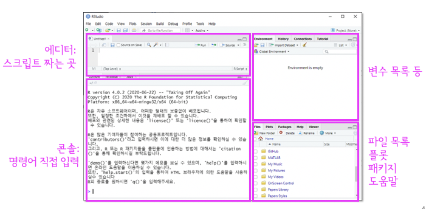

<style>
div.gray pre {background-color:lightgray;}
div.gray pre.r {background-color:gray;}
</style>

<style type="text/css">

body{ /* Normal  */
      font-size: 16px;
  }
td {  /* Table  */
  font-size: 16px;
}
h1.title {
  font-size: 38px;
  color: Black;
}
h1 { /* Header 1 */
  font-size: 28px;
  font-weight: bold;
  color: DarkBlue;
}
h2 { /* Header 2 */
  font-size: 22px;
  font-weight: bold;
  font-family: NanumGothic;
  color: DarkBlue;
  
}
h3 { /* Header 3 */
  font-size: 18px;
  font-weight: bold;
  font-family: NanumGothic;
  color: DarkBlue;
}
h4 { /* Header 4 */
  font-size: 16px;
  font-weight: bold;
  font-family: NanumGothic;
  color: Black;
}
h5 { /* Header 5 */
  font-size: 12px;
  font-family: NanumGothic;
  color: Gray;
}
code.r{ /* Code block */
    font-size: 12px;
}
    font-size: 14px;
}
</style>

```{r xaringanExtra-clipboard, echo=FALSE}
xaringanExtra::use_clipboard()
```

```{r include=FALSE}
knitr::opts_chunk$set(fig.align = "center", message=F, warning=F, fig.height = 3, cache=T, dpi = 300)
```

# **01. R Data 분석 환경 구축**

##### 본 학습은 [나성호의 R 데이터 분석 입문](https://www.aladin.co.kr/shop/wproduct.aspx?ItemId=281235259)과 [Do it 쉽게 배우는 R 데이터 분석](http://www.kyobobook.co.kr/product/detailViewKor.laf?mallGb=KOR&ejkGb=KOR&barcode=9791187370949)을 기반으로 이루어집니다   

## **0. R & RStudio**
- R은 통계 프로그래밍 플랫폼입니다. 처음에는 통계학자들이 주로 사용하였으나, 최근에는 사회과학 전분야에서 두루 활용되고 있습니다. R이 인기를 끄는 데는 두 가지 이유가 있습니다. 잘 알려진 SPSS나 SAS와 달리 GNU license로서 오픈소스에 무료입니다. 게다가 다양한 패키지를 연결하여 기능을 크게 확장할 수 있습니다.   
  
- RStudio는 R을 쉽게 사용할 수 있게 해주는 통합 개발 환경(integrated  development environment,> 
IDE)입니다. Visual Studio나, Google Colab을 사용하시는 분도 있지만, 일반적으로 RStudio를 통해 R을 사용합니다. 
  


---

## **1. R 과 RStudio 설치**

R을 이용하는 방법에는 로컬컴퓨터(자신의 컴퓨터)와 클라우드를 이용하는 방법 2가지가 있습니다. 

#### 1) 컴퓨터에 R을 설치해 이용
  - 장점: 내 컴퓨터에서 사용하므로 편의성이 높다.  
  - 단점: 컴퓨터 사양이 낮으면 매우 불편하다.  
      
        
#### 2) 클라우드에서 R 이용
  - 장점: 컴퓨터 사양이 낮아도 브라우저만 있으면 된다.   
  - 단점: 매번 패키지를 설치해야 한다.   
    
    ※ [RStudio클라우드](http://studiocloud.com/)와 [구글 코랩](http://colab.to/r) 등이 R을 클라우드에서 사용할 수 있는 IDE입니다.   
       구글 코랩의 기본값은 파이썬이지만, 위 주소로 연결하면 R이 사용언어로 설정됩니다.  

---  

### **1-1. R과 Rtools 로컬컴퓨터에 설치하기**

#### 1) 설치 경로에 한글이 섞여있으면 향후 진행이 어렵습니다.  
  - 가능하면 C://이후 user명도 한글이 아닌 영어로 변경해야합니다.  
  - 또한 모든 설치 파일은 '관리자 모드로 실행' 해주셔야 합니다.  
  - (참고 링크: [https://url.kr/b4zkl2](https://url.kr/b4zkl2))  
  
  
#### 2) R project사이트에서 접속 링크 [(cloud.r-project.org)](https://cloud.r-project.org/)로 직접 접속하거나, 구글에서 “r project” 검색
  
  
#### 3) 본인의 운영체제에 맞는 R다운로드 후 설치  
  - R을 설치하고 실행하면 콘솔 창이 열립니다. > 프롬프트가 뜨면 정상입니다.  
  
#### 4) Rtools는 [이곳](https://cran.r-project.org/bin/windows/Rtools/rtools40.html)을 클릭하신 뒤, [rtools40v2-x86_64.exe] 를 다운받아주세요.   
  
#### 5) 이후 **rtools40v2-x86_64.exe** 파일을 실행시키시고, 계속 '다음'을 누르셔서 설치하시면 됩니다.  
  
#### 6) 설치가 완료 된 이후에는 환경변수 설정을 해주셔야 합니다.   
  - 이 부분은 학습 시간에 함께 진행하겠습니다.   
    
    > (1) RTOOLS40_HOME 환경변수 생성: 값 - `C:\rtools40`  
    
    > (2) 윈도우 검색창에 '시스템 환경 변수 편집' 검색   
    
    > (3) system variable > edit 하여 환경변수 추가  
    
    > (4) system variables > path에 %RTOOLS40_HOME%\usr\bin 추가
  
  
---  

### **1-2. Rstudio 로컬컴퓨터에 설치하기**  
  
1) 구글에서 ’rstudio’를 검색하거나 이 링크 [R Studio Desktop Free](https://rstudio.com/products/rstudio/download/#download)에서 다운로드 받아 설치합니다.  
    
2) 설치한 다음 아래처럼 실행되면 설치에 성공한 것입니다.  화면에 3개의 창틀이 열려 있는데, 각 창을 pane(창틀)이라고 합니다.  
  
3) 대부분의 IDE들은 비슷한 인터페이스를 가지고 있습니다. RStudio는 Matlab과 비슷한 인터페이스를 가지고 있으며, 처음 쓰시는 분들도 직관적으로 이해하실 수 있습니다.  
  

  
  * Editor: 편집기. 워드프로세서에 글을 쓰듯이, 스크립트를 편집하고 저장하고 열어보는 데 사용합니다. ‘도킹해제 undock’를 통해 큰 화면에서 별도로 작업할 수 있습니다. 
    
  * Console: 명령어를 입력하고 출력을 확인합니다. 매우 유용하게 쓰입니다. 
    
  * Environment & History: 현재 사용 중인 변수들와 지금까지 사용한 명령어를 각각 보여줍니다.
    
  * Files: MS윈도우의 탐색기 또는 OSX의 Finder 역할을 합니다. 현재 위치를 보여줍니다.  
          Console 창에 `getwd()`을 입력해서 현재 위치를 볼 수도 있습니다.   
           
  * Plots: 그래프를 볼 때 사용합니다.  
  
  * Packages: 지금까지 설치한 패키지와 현재 사용중인 패키지를 보여줍니다. 새로운 패키지를 설치할 때도 사용합니다.   
      + *Update*를 실행해봅시다. 자주 업데이트 하는 것이 좋습니다.
      + *Install*을 실행하여 **vcd**라는 패키지를 설치해봅시다. 이 패키지의 내용이 무엇인지도 인터넷으로 알아봅시다.  
      
  * Help: 도움말  
    
  * Viewer: 웹컨텐츠를 볼 때 사용합니다.    
   
4) 여기까지 모든 설치가 잘 끝났는지 확인하기 위해 Rstudio console 창에 아래와 같이 입력 후 확인합니다.   
  
```{r eval=FALSE}
Sys.which('make')

#                             make 
#"C:\\rtools40\\usr\\bin\\make.exe"
```

---  

### **1-3. 작업환경 있어보이게 만들기**  
  
  - 가독성을 높여주는 Ligature 폰트를 적용합니다. 
  - Github에 올라와 있는 Firacode 를 [링크](https://github.com/tonsky/FiraCode/releases/download/6.2/Fira_Code_v6.2.zip)에서
    다운해줍니다.   
  - 압축해제 후, ttf 폴더에 들어가셔서 **모든 사용자용으로 설치** 를 해줍니다. 
  - 이후, 아래 두줄을 실행시킨 뒤 Rstudio를 종료하세요.   

```{r eval=FALSE}

install.packages("remotes")
remotes::install_github("anthonynorth/rscodeio")

```
  - 관리자 권한으로 Rstudio을 열어서 아래 명령을 실행시켜주세요. 
  
```{r eval=FALSE}

rscodeio::install_theme()

```

  - Rstudio의 Tools > Global options > appearance 에 가셔서 폰트를 Fira 폰트로 바꿔줍니다. 