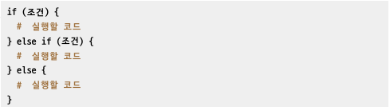
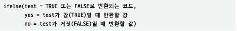
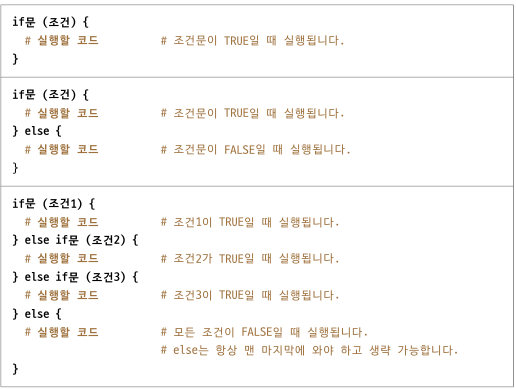
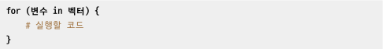
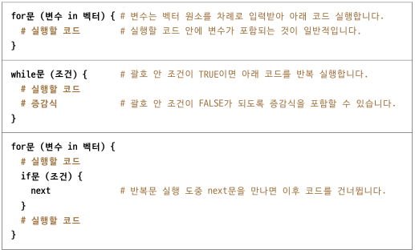
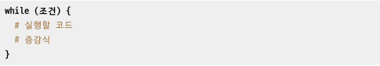
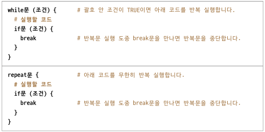

```{r xaringan-themer, include=FALSE, warning=FALSE}
library(xaringanthemer)
style_mono_accent(base_color = "#43418A",
                  base_font_size = "14px",
                  text_font_size = "1.2rem",
                  header_h1_font_size = "2.2rem",
                  header_h2_font_size = "2rem",
                  header_h3_font_size = "1.7rem",
                  header_background_auto = FALSE,
                  code_font_size = "1rem",


)

```

```{r xaringanExtra-clipboard, echo=FALSE}
xaringanExtra::use_clipboard()
```

```{r include=FALSE}
knitr::opts_chunk$set(fig.align = "center", message=F, warning=F, fig.height = 3, cache=T, dpi = 300)
```

```{r include=FALSE}
library(tidyverse)

```

# 07. 조건문과 반복문

## 0. 학습 안내 

  - 이번 시간에는 조건문의 대표 **if, ifelse문**과 반복문의 대표 **for문**을 학습하고자 합니다  
  - 원리는 매우 간단하지만 응용이 복잡할 때가 많다보니, 학습에 어려움을 느끼실 수도 있습니다  
    하지만, 한 번만 제대로 익혀두시면 앞으로 정말 편하실 것입니다!

  ### 조건문  
    - 조건문은 내가 원하는 조건에 따라 코드를 다르게 실행하고 싶을 때 사용합니다   
  
  ### 반복문  
    - 반복문은 내가 설정한 기준만큼 특정 코드를 반복하고 싶을 때 사용합니다
  
  ##### 본 학습은 [나성호의 R 데이터 분석 입문](https://www.aladin.co.kr/shop/wproduct.aspx?ItemId=281235259)과 [Do it 쉽게 배우는 R 데이터 분석](http://www.kyobobook.co.kr/product/detailViewKor.laf?mallGb=KOR&ejkGb=KOR&barcode=9791187370949)
을 기반으로 이루어집니다 
---

## 1. 조건문  

### 1.1 if문 

#### if문은 조건에 따라 실행할 코드를 바꿀 수 있습니다  
#### if, else if, else를 사용해서 끝없이 조건을 만들어낼 수 있습니다

  



  
#### 위 그림만 기억하시면, 조건문은 끝났다고 생각하시면 됩니다

---
### 1.2 if문 실습

#### 아래 Script를 복사해서 붙여넣고 실행해봅니다

```{r eval=FALSE}

# 1. 정수형 벡터를 생성합니다 
obj <- 1L

# 2. 벡터의 클래스를 확인합니다 
class(x = obj)

# 3. 클래스가 'integer'인지 비교 연산을 해봅니다
class(x = obj) == 'integer'

# 4. if문 기본 구문에 클래스가 'integer'인지 비교해서, 맞을 경우 출력하도록 합니다
if (class(x = obj) == 'integer') print(x = '정수입니다!')

# 5. 뒤따르는 실행코드는 보통 중괄호를 사용해서 묶습니다
if (class(x = obj) == 'integer') {
  print(x = '정수입니다!')
}

# 6. if문의 괄호 안의 값이 FALSE이면 중괄호 안 코드를 실행하지 않습니다
obj <- as.character(x = obj)
if (class(x = obj) == 'integer') {
  print(x = '정수입니다!')
}

```

---
### 1.3 if else문 실습

#### 아래 Script를 복사해서 붙여넣고 실행해봅니다

```{r eval=FALSE}
# 1. if문의 괄호 안의 값이 FALSE일 때, 실행할 코드를 else문에 추가해봅니다 

if (class(x = obj) == 'integer') {
  print(x = '정수입니다!')
} else {
  print(x = '정수가 아닙니다!')
}

# 2. 결과가 어떻게 다르게 나왔는지 확인합니다
```

---

### 1.4 if else문 실습

#### 아래 Script를 복사해서 붙여넣고 실행해봅니다

```{r eval=FALSE}
# 1. if문에서 고려해야 할 조건 추가합니다
if (class(x = obj) == 'integer') {
  print(x = '정수입니다!')
} else if (class(x = obj) == 'numeric') {
  print(x = '실수입니다!')
} else {
  print(x = '숫자가 아닙니다!')
}

# 2. 합격여부를 새로운 객체에 저장합니다
score <- 100
if (score >= 70) {
  grade <- '합격'
} else {
  grade <- '불합격' 
}

# 3. 결과를 콘솔 창에 출력해봅니다
print(x = grade)

# 4. 원소가 2개 이상인 벡터로 조건문을 실행해봅니다
score <- c(100, 69)
if (score >= 70) {
  grade <- '합격'
} else {
  grade <- '불합격' 
}

# 5. 결과를 콘솔 창에 출력해봅니다
print(x = grade)
```

---

### 1.5 ifelse() 함수 실습

#### 아래 Script를 복사해서 붙여넣고 실행해봅니다

```{r eval=FALSE}
# 여러 원소를 갖는 벡터 생성
score <- seq(from = 40, to = 100, by = 10)

# score의 각 원소가 70 이상인지 비교 연산 실행
score >= 70

# ifelse() 함수를 이용하여 새로운 문자형 벡터 생성
ifelse(test = score >= 70, yes = '합격', no = '불합격')

# score를 원소로 갖는 데이터프레임 생성
df <- data.frame(score)

# df의 구조 확인
str(object = df)

# ifelse() 함수를 이용하여 df에 새로운 파생 변수 생성
df$grade <- ifelse(test = df$score >= 70, yes = '합격', no = '불합격')

# df를 콘솔 창에 출력
print(x = df)
```
---
### 1.6 조건문 종합 정리

#### 조건문 관련해서 지금까지 실습해본 내용을 정리하면 아래와 같습니다 
  



---
## 2. 반복문   

#### 반복문은 여러 줄의 코드에서 일부 값만 변경하면서 반복적으로 실행하고자 할 경우 사용합니다
#### 아래 그림을 보시면, 이해가 더 쉬우실 것입니다
#### 동일하게 반복문 역할을 하는 함수 중 for문과 while문을 자주 사용합니다
   

  

---
### 2.1 for문(1)
#### 아래 Script를 복사해서 붙여넣고 실행해봅니다

```{r eval=FALSE}
# 1. 변수가 차례대로 입력받을 값을 원소로 갖는 벡터를 생성합니다
menu <- c('짜장면', '탕수육', '깐풍기', '짬뽕', '전가복', '샥스핀')

# 2. for문을 실행해봅니다
#    menu에 있는 벡터를 차례대로 가져와서 item 변수에 넣고, 출력합니다
for (item in menu) {
  print(x = item)
}

#3. for문을 실행해봅니다 
#   menu에 있는 벡터를 차례대로 가져와서 item 변수에 넣기는 하지만, 출력은 하지 않습니다. 
for (item in menu) {
  item
}

```

---

### 2.2 for문(2)

#### 아래 Script를 복사해서 붙여넣고 실행해봅니다


```{r eval=FALSE}
#1. 두 문자열을 연결해서 출력하는 경우에는 cat() 함수를 사용합니다
#2. print 함수를 사용할 경우 에러가 납니다
menu <- c('짜장면', '탕수육', '깐풍기', '짬뽕', '전가복', '샥스핀')
for (item in menu) {
  print(item, '시킬까요?\n')
}

#3. cat() 함수로 두 문자열을 연결해서 출력할 수 있습니다
for(item in menu) {
  cat(item, '시킬까요?\n')
}

#4. 또는 paste()함수로 묶어서 print 함수로 출력할 수도 있습니다
for (item in menu) {
  text <- paste(item, '시킬까요?\n')
  print(x = text)
}

```

---
### 2.3 while문(1)


#### 아래 Script를 복사해서 붙여넣고 실행해봅니다

```{r eval=FALSE}

# 1. 숫자형 벡터를 생성합니다
i <- 5

# 2. while문을 실행해봅니다 
while(i > 0) {
  print(x = i)
  i <- i - 1
}

```

---
### 2.4 while문(2)
#### 아래 Script를 복사해서 붙여넣고 실행해봅니다  
```{r eval=FALSE}
# 변수가 차례대로 입력받을 값을 원소로 갖는 벡터 생성
menu <- c('짜장면', '탕수육', '깐풍기', '짬뽕', '전가복', '샥스핀')

# 반복문 안에 조건문 추가하여 실행할 코드 제어
for (item in menu) {
  if (item %in% c('짜장면', '짬뽕')) {
    cat(item, '요리부터 주문합시다!\n', sep = '? ')
  } else {
    cat(item, '다음 메뉴는 뭔가요?\n', sep = '? ')
  }
}

# 반복문 실행 도중 next를 만나면 처음으로 되돌아감
for (item in menu) {
  if(item %in% c('짜장면', '짬뽕')) {
    next
    cat(item, '요리부터 주문합시다!\n', sep = '? ')
  }
  cat(item, '다음 메뉴는 뭔가요?\n', sep = '? ')
}
```
---
### 2.5 while문(3)
#### 아래 Script를 복사해서 붙여넣고 실행해봅니다
```{r eval=FALSE}
# 6.4 반복문 탈출하기 : break
# 반복문 실행 도중 break를 만나면 반복문 중단
i <- 0
while (TRUE) {
  print(x = i)
  i <- i + 1
  if(i > 5) {
    break
  }
}


# 6.4.2 for문에서 break 사용하기
# 반복문 실행 도중 break를 만나면 반복문 중단
for (i in 0:9) {
  print(x = i)
  if(i > 5) {
    break
  }
}


```
---
### 2.6 repeat문


#### 아래 Script를 복사해서 붙여넣고 실행해봅니다

```{r eval=FALSE}

# 1. repeat문을 실행해봅니다
i <- 0
repeat {
  print(x = i)
  i <- i + 1
  if(i > 5) {
    break
  }
}


```

