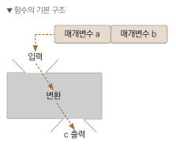
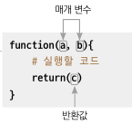

```{r xaringan-themer, include=FALSE, warning=FALSE}
library(xaringanthemer)
style_mono_accent(base_color = "#43418A",
                  base_font_size = "14px",
                  text_font_size = "1.2rem",
                  header_h1_font_size = "2.2rem",
                  header_h2_font_size = "2rem",
                  header_h3_font_size = "1.7rem",
                  header_background_auto = FALSE,
                  code_font_size = "1rem",


)

```

```{r xaringanExtra-clipboard, echo=FALSE}
xaringanExtra::use_clipboard()


```

```{r include=FALSE}
knitr::opts_chunk$set(fig.align = "center", message=F, warning=F, fig.height = 3, cache=T, dpi = 300)
```

# 08. 나만의 함수 만들기

## 0. 학습 안내   
  - R에서 기본으로 제공하는 함수나, 다양한 패키지에서 제공하는 함수로 정말 많은 것들을 할 수 있지만, 한계가 있습니다  
  
  - 이번에는 사용자 정의함수를 활용해서 내가 원하는 기능을 구현하는 함수를 만들어보겠습니다  
    
  - 내가 원하는 함수를 정의하고 사용하는 것은 아닙니다 분석 속도를 높여주고, 반복 작업을 할 때 매우 유리합니다  
  
  ※ 본 학습은 [나성호의 R 데이터 분석 입문](https://www.aladin.co.kr/shop/wproduct.aspx?ItemId=281235259)과 [Do it 쉽게 배우는 R 데이터 분석](http://www.kyobobook.co.kr/product/detailViewKor.laf?mallGb=KOR&ejkGb=KOR&barcode=9791187370949)
  을 기반으로 이루어집니다 
  
---

## 1. 함수 정의 

### 1.1 함수의 구조  
  
#### 함수의 구조는 앞서 설명드렸듯이 간단합니다. 입력을 받아 변환한 뒤 내가 원하는 결과를 출력합니다. 

  
  
### 1.2 사용자 정의 함수 기본 구조
  
#### 사용자 정의 함수를 만들때는 function() 함수를 활용합니다 
  
  
  


---
### 1.3 사용자 정의 함수 만들기  

#### 피타고라스 정리를 사용자 정의함수로 구현해봅니다

```{r}
# 1. 피타고라스 정리를 사용자 정의 함수로 생성합니다
Pythagoras <- function(a, b) {
  c <- sqrt(x = a^2 + b^2)    
  return(c)                   
}

# 2. Pythagoras 함수를 실행해봅니다
Pythagoras(a = 3, b = 4)

```

---

### 1.4 사용자 정의 함수 저장하고 활용하기 

#### 사용자 정의함수를 정의하고, 저장한 뒤 사용하는 법을 확인해봅니다. 

```{r eval=FALSE}

# 1. 점수 벡터 생성합니다
score <- 100

# 2. 점수를 입력받아 학점을 반환하는 if문을 실행해봅니다 
if(score >= 90) {
  grade <- 'A'
} else if(score >= 80) {
  grade <- 'B'
} else if(score >= 70) {
  grade <- 'C'
} else if(score >= 60) {
  grade <- 'D'
} else {
  grade <- 'F'
}

# 3. 결과를 콘솔 창에 출력해봅니다
 print(x = grade)


```

---
### 1.4 사용자 정의 함수 저장하고 활용하기 

#### 앞서 만든 if문과 출력을 하나의 함수로 정의할 수 있습니다

```{r eval=FALSE}
# 1. 점수를 입력받아 학점을 반환하는 사용자 정의 함수 생성
getGrade <- function(score) {
  
  # 앞서 정의한 if문을 그대로 가져옵니다 
  
  if(score >= 90) {
    grade <- 'A'
  } else if(score >= 80) {
    grade <- 'B'
  } else if(score >= 70) {
    grade <- 'C'
  } else if(score >= 60) {
    grade <- 'D'
  } else {
      grade <- 'F'
  }
  return(print(grade)) # grade 결과값을 반환한다는 의미입니다
}

# 2. 점수로 학점 반환
getGrade(score = 100)


```
---
### 1.4 사용자 정의 함수 저장하고 활용하기 

#### 파일로 저장한 사용자 정의 함수 재활용해봅니다

```{r eval=FALSE}
# 1. 저장해두었던 getGrade() 함수를 삭제합니다
rm(getGrade)

# 2. 점수로 학점 반환이 되는지 해봅니다 
getGrade(score = 100)

# 3. 미리 저장해둔 'myFuns.R' 파일을 읽어옵니다
source(file = 'myFuns.R', encoding = 'UTF-8')

# 4. 다시 함수를 실행해보면 정상적으로 되는 것을 확인 할 수 있습니다
getGrade(score = 100)

```
---
### 1.5 인수 기본값 설정 

#### 사용자 정의 함수에 인수 기본값을 설정합니다

```{r eval=FALSE}
# 1. 저장해두었던 getGrade() 함수를 삭제합니다
rm(getGrade)

# 1. 점수를 입력받아 학점을 반환하는 사용자 정의 함수 생성
getGrade <- function(score = 100) {
  
  # 앞서 정의한 if문을 그대로 가져옵니다 
  
  if(score >= 90) {
    grade <- 'A'
  } else if(score >= 80) {
    grade <- 'B'
  } else if(score >= 70) {
    grade <- 'C'
  } else if(score >= 60) {
    grade <- 'D'
  } else {
      grade <- 'F'
  }
  return(print(grade))
}


# 4. 다시 함수를 실행해보면 score=100이 기본 인수로 실행이 되는 것을 알 수 있습니다
getGrade()

getGrade(score = 60)

```
